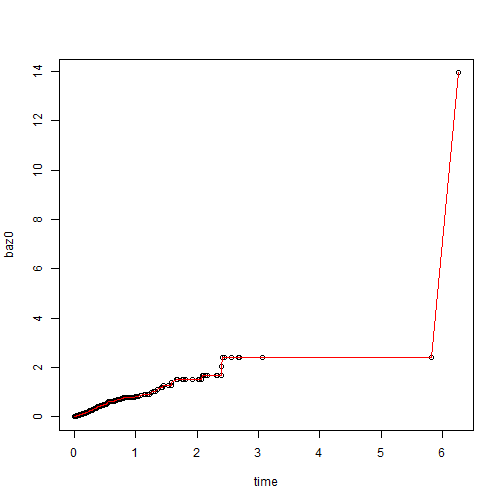

### Abstract

The function $\mathsf{basehaz\_ab}$ provides a fast $\mathsf{R}$
implementation for generalized Breslow estimator. In Cox PH model,
the implementation are around 50 times fast than the routine function
$\mathsf{survival::basehaz}$. 

### Background

{[}Breslow estimator{]}(http://www.ncbi.nlm.nih.gov/pubmed/17768681)
provided the MLE for the cumulative baseline hazard function for Cox
PH model. Let$(t,\delta,X)$ denote observation time, event indicator
and covariates. In Cox PH model, the log likelihood function for baseline
hazard function are equivalent to 
\[
l=\sum_{i=1}^{n}\{\delta_{i}\log\lambda(t_{i})-\exp(X_{i}\beta)\Lambda(t_{i})\},
\]
where $\lambda(\cdot)$ and $\Lambda(\cdot)$ are instantaneous and
cumulative baseline hazard functions. Models that extend Cox model
require to solve a general probelm
\[
l=\sum_{i=1}^{n}\{a_{i}\log\lambda(t_{i})-b_{i}\Lambda(t_{i})\},
\]
e.g. {[}Cox PH cure model{]}(http://onlinelibrary.wiley.com/doi/10.1111/j.0006-341X.2000.00227.x/abstract).
Let $y$ denote uncured indicator. In Cox PH cure model we have
\[
a_{i}=y_{i}\delta_{i}\;b_{i}=y_{i}\exp(X_{i}\beta).
\]
The MLE of generalized log likelihood function is 
\[
\hat{\lambda}(t_{i})=\frac{a_{i}}{\sum_{i\in\mathcal{R}(t)}b_{i}},\;\hat{\Lambda}(t)=\sum_{i=1}^{n}\frac{I(t_{i}<t)a_{i}}{\sum_{i\in\mathcal{R}(t)}b_{i}},
\]
where $\mathcal{R}(t)=\{i:t_{i}\ge t\}$ is the at risk set at time
$t$. 


### Illustration 

Simulate simple Cox PH model with exponential baseline.


```r
library(survival)
source("basehaz_ab.R")


set.seed(123)
N <- 300
x <- rnorm(N)
error <- log( - log( runif(N) ) )
t <- exp( - x * 2 + error)  # Cox model with exponential baseline
cen <- rexp( N )
time <- pmin(t, cen)
status <- t < cen
fit <- coxph(Surv(time, status) ~ x)
fit
```

```
## Call:
## coxph(formula = Surv(time, status) ~ x)
## 
## 
##    coef exp(coef) se(coef)    z      p
## x 1.978     7.229    0.138 14.3 <2e-16
## 
## Likelihood ratio test=259  on 1 df, p=0
## n= 300, number of events= 149
```

Check the equivalence of $\mathsf{basehaz\_ab}$ and $\mathsf{survival::basehaz}$


```r
## Derived Baseline Hazard
baz0 = basehaz_ab( a = status, b = exp(fit$coef * x), t = time)
## Buildin Baseline Hazard
baz1 = basehaz(fit, centered = F)

## Check Equivalence
plot( time, baz0)
lines(baz1$time, baz1$hazard, col = 2)
```

 

```r
max( abs(sort(baz0) - baz1$hazard) )
```

```
## [1] 3.730349e-14
```

Compare the caculation Time


```r
## Compare Time
system.time({
  for(i in 1:100) baz0 = basehaz_ab( a = status, b = exp(fit$coef * x), t = time)
})
```

```
##    user  system elapsed 
##       0       0       0
```

```r
system.time({
  for(i in 1:100) baz1 = basehaz(fit, centered = F)
})
```

```
##    user  system elapsed 
##    0.67    0.02    0.77
```

