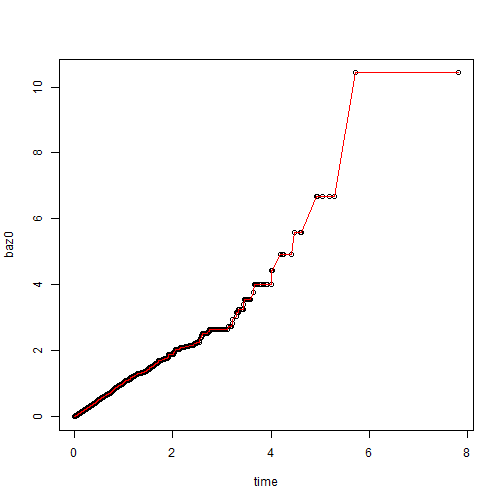

### Abstract

The function `basehaz_ab` provides a fast `R`
implementation for generalized Breslow estimator. In Cox PH model,
the implementation are around 50 times fast than the routine function
`survival::basehaz`. 

* The Math background can be found [here](https://cdn.rawgit.com/elong0527/Cox_basehaz/master/readme_full.html)


### Illustration 

Simulate simple Cox PH model with exponential baseline.


```r
library(survival)
source("basehaz_ab.R")


set.seed(123)
N <- 5000
x <- rnorm(N)
error <- log( - log( runif(N) ) )
t <- exp( - x * 2 + error)  # Cox model with exponential baseline
cen <- rexp( N )
time <- pmin(t, cen)
status <- t < cen
fit <- coxph(Surv(time, status) ~ x)
fit
```

```
## Call:
## coxph(formula = Surv(time, status) ~ x)
## 
## 
##     coef exp(coef) se(coef)    z      p
## x 2.0450    7.7290   0.0343 59.7 <2e-16
## 
## Likelihood ratio test=4536  on 1 df, p=0
## n= 5000, number of events= 2485
```

Check the equivalence of `basehaz_ab` and `survival::basehaz`


```r
## Derived Baseline Hazard
baz0 = basehaz_ab( a = status, b = exp(fit$coef * x), t = time)
## Buildin Baseline Hazard
baz1 = basehaz(fit, centered = F)

## Check Equivalence
plot( time, baz0)
lines(baz1$time, baz1$hazard, col = 2)
```

 

```r
max( abs(sort(baz0) - baz1$hazard) )
```

```
## [1] 4.94822e-11
```

Compare the caculation Time


```r
## Compare Time
system.time({
  for(i in 1:100) baz0 = basehaz_ab( a = status, b = exp(fit$coef * x), t = time)
})
```

```
##    user  system elapsed 
##    0.12    0.00    0.12
```

```r
system.time({
  for(i in 1:100) baz1 = basehaz(fit, centered = F)
})
```

```
##    user  system elapsed 
##    8.39    0.00    8.64
```

